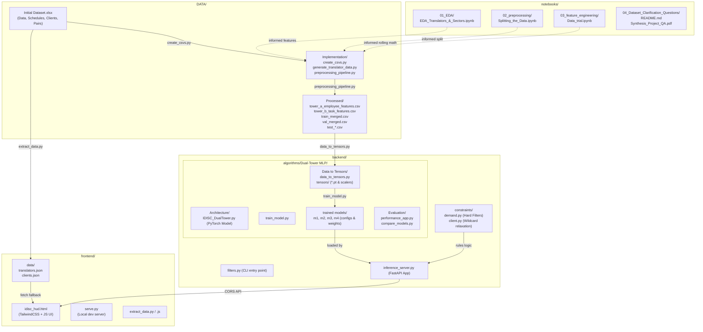
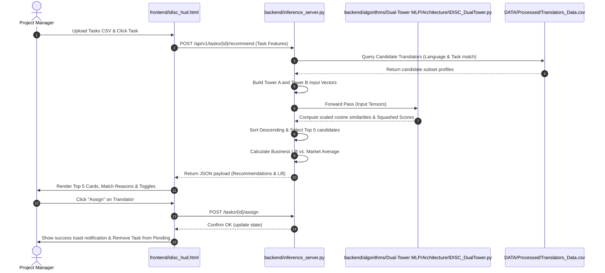

# iDISC AssignMate — Group Project

Welcome to the **iDISC AssignMate** repository. This is our group's prototype for the iDISC challenge, designed as a decision-support decision copilot to help Project Managers (PMs) match translators with incoming translation, proofreading, and post-editing tasks.

Rather than operating as a "black box" that assigns tasks automatically, the **AssignMate Dashboard** calculates all constraints and suggests the top 5 best translators for the job, detailing the business reasons (cost, quality, schedule, margin) behind each recommendation to let the PM make the final informed assignment.

---

## ⚡ Quick Start

### 1. Launch the Frontend
The frontend dashboard works offline by default using pre-built JSON databases.
```bash
# 1. Navigate to the frontend folder
cd frontend

# 2. Start the local server
python serve.py
```
This automatically opens your browser to **http://localhost:8080/idisc_hud.html**.

### 2. Launch the FastAPI Inference Server (Optional)
To run live machine learning recommendations using the PyTorch Dual-Tower models:
```bash
# 1. Ensure you have the dependencies installed
pip install -r backend/algorithms/Dual-Tower\ MLP/Architecture/requirements.txt

# 2. Run the server
python backend/inference_server.py
```
The server runs on **http://localhost:8000**, and the frontend will automatically detect it and switch to **Online Mode**.

---

## 1. High-Level System Architecture & Component Mapping

The project is divided into four main pillars: Data Pipeline, Backend constraints/algorithms, Frontend HUD web application, and Exploratory notebooks.



---

## 2. Core Data Pipeline & Preprocessing

The dataset pipeline takes raw translator/client data and prepares it for rule-based filters and machine learning training, ensuring no **data leakage** occurs.

### 2.1 Raw Data Extraction
*   [create_csvs.py](file:///c:/GitHub/tasks-assignment-in-translation-team-6/DATA/Implementation/create_csvs.py): Extracts zipped Excel sheets into individual CSV tables under `DATA/Initial Dataset/CSV/`.
*   [generate_translator_data.py](file:///c:/GitHub/tasks-assignment-in-translation-team-6/DATA/Implementation/generate_translator_data.py): Aggregates translator history to compute their latest state. Saves this as `DATA/Processed/Translators_Data.csv`, which acts as the current roster for rule-based checks.

### 2.2 Time-Series Feature Engineering ([preprocessing_pipeline.py](file:///c:/GitHub/tasks-assignment-in-translation-team-6/DATA/Implementation/preprocessing_pipeline.py))
To prevent the model from "cheating" by seeing future performance, all engineered features are calculated as expanding rolling windows computed strictly prior to a task's start date:
*   **Rolling Experience Counters**: Tracks overall task counts, sector experience (e.g. `domain_experience`), and task-type experience.
*   **Rolling Performance Ratings**: exponential moving average (EMA) of quality evaluations (`rolling_quality_ema`), punctuality scores, and forecast-vs-actual efficiency ratios.
*   **Availability Features**: Converts schedules into numeric lengths, availability hours, and weekend work flags.
*   **Cold Start Flags**: Identifies new employees (`IS_NEW_EMPLOYEE` for tasks < 10) and specialists (`IS_SPECIALIST` for high-rate, low-volume workers) to guide the neural network.

### 2.3 Affinity Score Formulation ($Y$)
Instead of training the model on who was historically chosen, it is trained to predict the post-task outcome suitability represented by `AFFINITY_LABEL` ($0.0$ to $1.0$):
$$\text{AFFINITY\_LABEL} = 0.40 \times \text{Quality Score} + 0.30 \times \text{Time Efficiency} + 0.30 \times \text{Profit Margin}$$
*   **Quality Score (40%)**: Normalized quality evaluation. If the quality falls below the client's `MIN_QUALITY`, a $-0.3$ penalty is applied.
*   **Time Efficiency Score (30%)**: Set to $1.0$ if delivered early/on-time. Decays linearly by $\max(0, 1 - \text{delay\_hours}/48)$ for delays.
*   **Economic Score (30%)**: Scaled profit margin computed from client hourly selling price vs translator rate.

### 2.4 Split Strategy
We split data chronologically: **70% Train** (`train_merged.csv`) for loss backpropagation, **15% Validation** (`val_merged.csv`) for tuning, and **15% Test** (`test_tasks.csv`, `test_translators.csv`, `test_labels.csv`) structured for Hit-Rate@K ranking evaluations.

---

## 3. Hard-Constraints Filtering Engine

Implemented in [backend/constraints/](file:///c:/GitHub/tasks-assignment-in-translation-team-6/backend/constraints/), these rules filter out infeasible candidates before applying the machine learning model.

### 3.1 Hard Filtering ([demand.py](file:///c:/GitHub/tasks-assignment-in-translation-team-6/backend/constraints/demand.py))
*   **C1 (Language Pair)**: Translator must support the exact source and target language pair.
*   **C2 (Task Type)**: Translator must have previously performed this task type.
*   **C2.5 (Availability)**: Translator must not be currently locked or assigned.
*   **C3 (Capacity)**: Available shift overlap hours within the demand window must satisfy:
    $$\text{Available Hours} \ge \text{Forecasted Hours} \times 1.5\text{ (Buffer)}$$

### 3.2 Client-Specific Wildcard Relaxation ([client.py](file:///c:/GitHub/tasks-assignment-in-translation-team-6/backend/constraints/client.py))
Clients define a `WILDCARD` priority (`Quality`, `Price`, or `Deadline`), allowing constraints to relax when no perfect candidate is available:
*   **Quality Wildcard**: Lowers the quality threshold by 30% ($\text{Client Min Quality} \times 0.7$).
*   **Price Wildcard**: Raises the price ceiling by 100% ($\text{Client Price} \times 2.0$).
*   **Deadline Wildcard**: Recovers candidates who failed the C3 schedule capacity filter. If their historical punctuality is $\ge 0.8$, the capacity buffer is relaxed from $1.5\times$ to $0.75\times$. Otherwise, it drops to a $1.0\times$ strict buffer.

---

## 4. Soft-Constraints AI Engine (Dual-Tower MLP)

Candidates that pass the constraints are scored by a **Two-Tower Neural Network** built in PyTorch.

```
  TOWER A (Employee)                                TOWER B (Task)
  Input Vector (132-D)                              Input Vector (140-D)
         │                                                 │
  [Linear(256) + BN + GELU + Drop]                  [Linear(256) + BN + GELU + Drop]
         │ (x1)                                            │ (y1)
  [Linear(256) + BN + GELU + Drop]                  [Linear(256) + BN + GELU + Drop]
         │ (x2)                                            │ (y2)
     x_res = x1 + x2 (Skip)                            y_res = y1 + y2 (Skip)
         │                                                 │
  [Linear(64)] (No Activation)                      [Linear(64)] (No Activation)
         │                                                 │
     emb_a (64-D)                                      emb_b (64-D)
         └───────────────┬─────────────────────────────┘
                         ▼
                 Cosine Similarity (cos_sim)
                         │
                  Scale by Temp (τ)
                         │
                     Sigmoid(·)
                         ▼
                Affinity Score [0, 1]
```

### 4.1 Architecture & Mechanics ([IDISC_DualTower.py](file:///c:/GitHub/tasks-assignment-in-translation-team-6/backend/algorithms/Dual-Tower%20MLP/Architecture/IDISC_DualTower.py))
*   **Heterogeneous Inputs**: Tower A encodes 132 translator features; Tower B encodes 140 task features.
*   **ResNet Skip Connections**: Each tower uses a bottleneck block with shortcut additions (`x1 + x2`) to enable stable gradient backpropagation and prevent vanishing gradients.
*   **Magnitude-Invariant Scoring**: Computes the cosine similarity between the projected 64-D embeddings.
*   **Learnable Temperature ($\tau$)**: Kosine similarity is scaled by a parameter $\tau$ that is trained via backpropagation, automatically adjusting the decisiveness of the score distributions. The final score is bounded in $[0.0, 1.0]$ via a sigmoid.
*   **Explainability Hook**: Exposes a `return_embeddings=True` parameter to fetch raw embeddings for UMAP visualizations or Captum feature attribution.

### 4.2 Training Pipeline ([train_model.py](file:///c:/GitHub/tasks-assignment-in-translation-team-6/backend/algorithms/Dual-Tower%20MLP/train_model.py))
*   Normalizes continuous features using [data_to_tensors.py](file:///c:/GitHub/tasks-assignment-in-translation-team-6/backend/algorithms/Dual-Tower%20MLP/Data%20to%20Tensors/data_to_tensors.py) (fitted strictly on train tensors).
*   Minimizes `BCELoss` using the `AdamW` optimizer and a `OneCycleLR` learning rate scheduler.
*   Enforces early stopping (patience=7) and saves model checkpoints inside the `trained models/` directory.

---

## 5. Inference & Frontend Integration

### 5.1 FastAPI Server ([inference_server.py](file:///c:/GitHub/tasks-assignment-in-translation-team-6/backend/inference_server.py))
The backend exposes a FastAPI REST service to serve recommendations:
*   Preloads and manages multiple trained model folders (`m1`, `m2`, `m3`, `m4`).
*   Runs rule-based filters from [demand.py](file:///c:/GitHub/tasks-assignment-in-translation-team-6/backend/constraints/demand.py) and [client.py](file:///c:/GitHub/tasks-assignment-in-translation-team-6/backend/constraints/client.py).
*   Embeds the task/client requests, performs inference through PyTorch, and ranks candidates.
*   Calculates **Business Lift** (projected margin increase and cost savings) vs. a baseline average translator.

### 5.2 User Interface Dashboard ([idisc_hud.html](file:///c:/GitHub/tasks-assignment-in-translation-team-6/frontend/idisc_hud.html))
A TailwindCSS single-page web dashboard for Project Managers:
*   **Interactive Dashboard Overview**: Added key business metrics, real-time forecast-based progress cards for active assignments (which resolve without manual timers), and a translator split donut chart showing workload distribution between Internal and Third-Party workers.
*   **Tasks Inbox**: Allows PMs to upload a CSV of pending tasks and select them to see recommendations.
*   **Constraint Controls**: Provides checkboxes to relax constraints (Schedule, Industry, Client Wildcards) and re-run recommendation scoring dynamically.
*   **Constraint Check Drawer**: Displays a detailed check accordion for each recommended translator, checking the 6 core SLA filters (Language Pair, Task Type, Assignment status, Shift Overlap, Client Min Quality, and Client price limits) and visually highlighting wildcard applications.
*   **Advanced Roster Filters**: Adds a collapsible panel to filter the translator database in real-time by worker type (Internal, Third-Party, Specialist, New), availability (Available, Assigned), minimum quality EMA (via slider), and multi-select source/target languages and task types.
*   **Manual Task Selector**: A search bar inside the task detail view allowing the PM to search and assign any translator from the roster, automatically filtered to display only those who satisfy all active SLA and capacity constraints.
*   **Model Selector**: Horizontal sliding carousel (`overflow-x-auto`) to switch the active model on the FastAPI server on-the-fly.
*   **Live Assignment Sync**: Selecting a translator updates local storage and immediately filters them out of recommendations for other tasks. Marking a translator as "Task Completed" automatically syncs their availability state and live-refreshes matching recommendations.
*   **Safe Task Assignment**: Employs robust try-catch blocks and instant toast notifications to guarantee seamless task allocations.

---

## 6. End-to-End Operational Flow

The sequence diagram below illustrates what happens when a Project Manager requests matching recommendations for a task:



---

## 7. Notebooks & Administrative Tools

### 7.1 Historical Notebooks (`notebooks/`)
*   [01_EDA/EDA_Translators_&_Sectors.ipynb](file:///c:/GitHub/tasks-assignment-in-translation-team-6/notebooks/01_EDA/EDA_Translators_&_Sectors.ipynb): Initial statistics on roster volumes, languages, and pricing metrics.
*   [02_preprocessing/Splitting_the_Data.ipynb](file:///c:/GitHub/tasks-assignment-in-translation-team-6/notebooks/02_preprocessing/Splitting_the_Data.ipynb): Prototypes the chronological time-series splitting.
*   [03_feature_engineering/Data_trial.ipynb](file:///c:/GitHub/tasks-assignment-in-translation-team-6/notebooks/03_feature_engineering/Data_trial.ipynb): Sandbox testing for expanding rolling windows.
*   [04_Dataset_Clarification_Questions/](file:///c:/GitHub/tasks-assignment-in-translation-team-6/notebooks/04_Dataset_Clarification_Questions/): PDF logs resolving dataset attributes with client.

### 7.2 Offline Administrative Metrics
*   [translator_metrics.py](file:///c:/GitHub/tasks-assignment-in-translation-team-6/Documentation/translator_metrics.py): A standalone tool that compiles overall quality ratings, quality by language pairs, and sector experience scores into a styled multi-sheet Excel spreadsheet.
